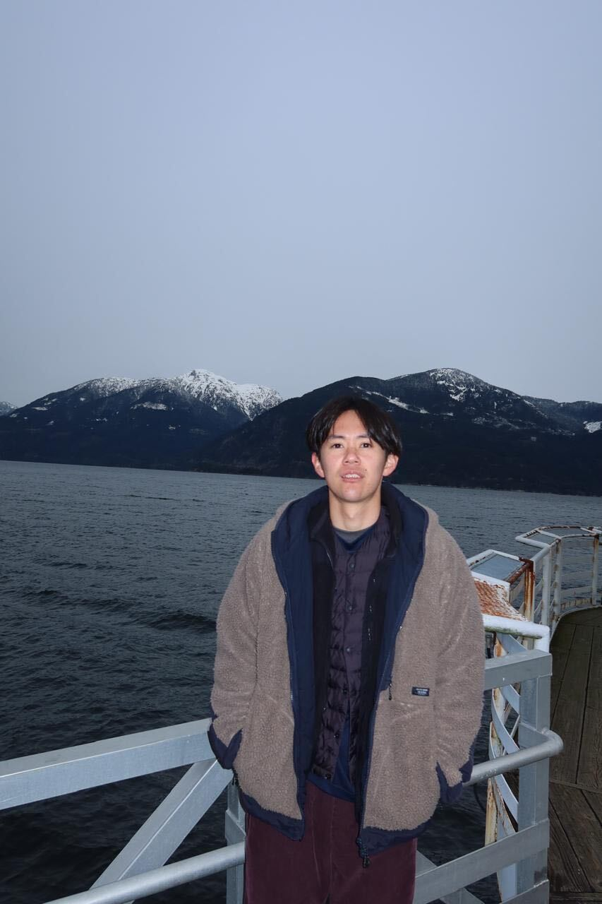

{.profile-photo fig-alt="Portrait of Yusuke Umehara"}

# Yusuke Umehara

## Climate & Energy Policy Researcher

I study pathways toward global climate mitigation using integrated assessment models.

Integrated Assessment Modeling

Climate Mitigation • Carbon Pricing • CCS & CDR

Kyoto University

::: {.hero-actions}
[Research](research.qmd){.btn .btn-primary}
[Publications](publications.qmd){.btn .btn-outline-primary}
[CV](cv.qmd){.btn .btn-outline-primary}
:::
:::

::: {.content-section}
## Research

::: {.research-grid}
::: {.research-card}
### Carbon Pricing & Equity

How should mitigation costs and opportunities be distributed across regions and generations?

[Explore this theme →](research.qmd#carbon-pricing-equity-climate-finance)
:::

::: {.research-card}
### Carbon Capture & Removal

What role can CCS and carbon dioxide removal play under geological, economic, and social constraints?

[Explore this theme →](research.qmd#carbon-capture-storage-carbon-removal)
:::

::: {.research-card}
### Long-term Decarbonization

How can Japan and the world achieve net zero while balancing energy security and sustainable development?

[Explore this theme →](research.qmd#long-term-decarbonization-pathways)
:::
:::
:::

::: {.statement}
## Current focus

Connecting quantitative scenario analysis with policy-relevant questions about feasibility, equity, and implementation.
:::

